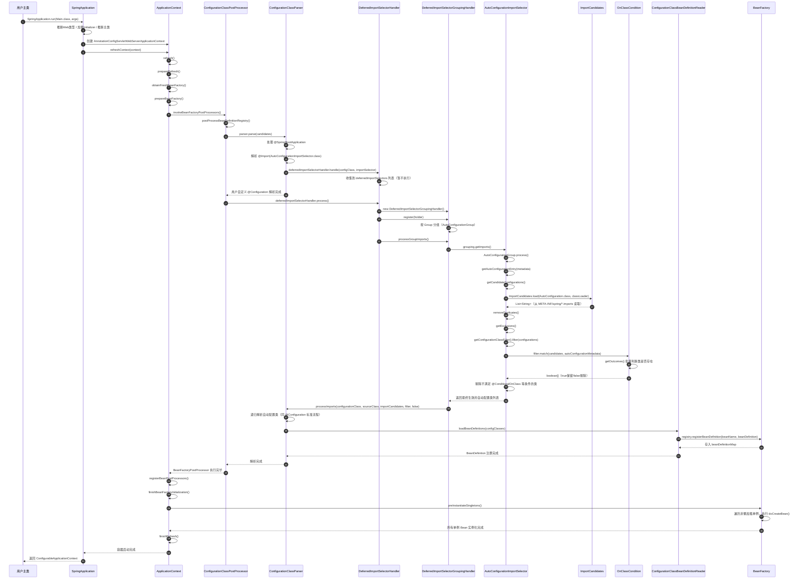

# Spring Boot 自动装配源码级流程详解

> **一句话定义**：Spring Boot 自动装配 = 在 Spring 容器 `refresh()` 的 `BeanFactoryPostProcessor` 阶段，通过
`DeferredImportSelector` 延迟机制，从 `META-INF/spring/*.imports` 读取候选配置类，经 `@Conditional` 条件过滤后，将其作为标准
`@Configuration` 类递归解析并注册为 `BeanDefinition` 的过程。

---

## 一、完整时序图



---

## 二、分阶段源码详解

### 阶段一：启动准备（SpringApplication）

```
SpringApplication.run(MainClass.class, args)
  └── new SpringApplication(primarySources).run(args)
        ├── 推断 Web 应用类型（SERVLET / REACTIVE / NONE）
        │     └── WebApplicationType.deduceFromClasspath()
        ├── 加载 ApplicationContextInitializer（SPI）
        │     └── SpringFactoriesLoader.loadFactories()
        ├── 加载 ApplicationListener（SPI）
        └── 推断主类（Main Class）
              └── new RuntimeException().getStackTrace() 技巧推断
```

**关键类**：`org.springframework.boot.SpringApplication`

---

### 阶段二：刷新容器（refreshContext）

```
AbstractApplicationContext.refresh()
  ├── prepareRefresh()              // 初始化 Environment、事件监听器
  ├── obtainFreshBeanFactory()      // 获取/刷新 BeanFactory
  ├── prepareBeanFactory()          // 注册类加载器、SpEL解析器、属性编辑器等
  ├── invokeBeanFactoryPostProcessors()   // ⭐ 自动装配触发点
  │     └── PostProcessorRegistrationDelegate.invokeBeanFactoryPostProcessors()
  │           └── ConfigurationClassPostProcessor.postProcessBeanDefinitionRegistry()
  │                 └── 创建 ConfigurationClassParser
  │                 └── parser.parse(candidates)   // 解析主类
  └── ...
```

**关键类**：`org.springframework.context.support.AbstractApplicationContext`

---

### 阶段三：延迟收集（DeferredImportSelectorHandler）

```
ConfigurationClassParser.parse()
  └── 处理主类上的 @SpringBootApplication
        └── 元注解 @Import(AutoConfigurationImportSelector.class)
              └── 识别为 DeferredImportSelector 实现类
                    └── deferredImportSelectorHandler.handle(configClass, importSelector)
                          └── 包装为 DeferredImportSelectorHolder
                          └── 加入 deferredImportSelectors 列表（收集阶段）

// 等所有用户配置类解析完成后：
ConfigurationClassPostProcessor
  └── deferredImportSelectorHandler.process()
        └── 创建 DeferredImportSelectorGroupingHandler
        └── 对所有 holder 执行 handler.register()
        └── handler.processGroupImports()   // ⭐ 真正开始自动装配
```

**关键类**：

- `org.springframework.context.annotation.ConfigurationClassParser`
- `org.springframework.context.annotation.ConfigurationClassParser.DeferredImportSelectorHandler`

---

### 阶段四：配置发现（读取 META-INF）

```
AutoConfigurationImportSelector.getAutoConfigurationEntry()
  └── getCandidateConfigurations()
        └── ImportCandidates.load(AutoConfiguration.class, classLoader)
              └── 读取 ClassPath 下所有 jar 包中的：
                    META-INF/spring/org.springframework.boot.autoconfigure.AutoConfiguration.imports
              └── 返回 List<String>

// Boot 2.7 及以下版本：
  └── SpringFactoriesLoader.loadFactoryNames(EnableAutoConfiguration.class, classLoader)
        └── 读取 META-INF/spring.factories
```

**关键类**：

- `org.springframework.boot.autoconfigure.AutoConfigurationImportSelector`
- `org.springframework.boot.autoconfigure.ImportCandidates`

**文件路径**：

- Boot 3.x：`META-INF/spring/org.springframework.boot.autoconfigure.AutoConfiguration.imports`
- Boot 2.x：`META-INF/spring.factories`（键为 `org.springframework.boot.autoconfigure.EnableAutoConfiguration`）

---

### 阶段五：条件过滤（@Conditional 体系）

```
AutoConfigurationImportSelector.getAutoConfigurationEntry()
  ├── removeDuplicates()                    // 去重
  ├── getExclusions()                       // 处理 @EnableAutoConfiguration 的 exclude/excludeName
  └── getConfigurationClassFilter().filter(configurations)
        └── 遍历 AutoConfigurationImportFilter（SPI 加载）
              └── 核心实现：OnClassCondition
                    └── OnClassCondition.match(candidates, autoConfigurationMetadata)
                          └── getOutcomes()   // 批量判断类是否存在
                                └── 优先读取 spring-autoconfigure-metadata.properties 缓存
                                └── 避免对每个类单独 Class.forName() 反射
                          └── 返回 boolean[]（true=保留，false=剔除）
        └── 剔除不满足 @ConditionalOnClass / @ConditionalOnMissingBean 等条件的类
```

**关键类**：

- `org.springframework.boot.autoconfigure.condition.OnClassCondition`
- `org.springframework.boot.autoconfigure.AutoConfigurationImportSelector.ConfigurationClassFilter`

**核心优化**：`OnClassCondition` 使用 **Outcomes 缓存** 和 **批量类加载判断**，避免 N 次反射带来的性能损耗。

---

### 阶段六：注册 BeanDefinition

```
DeferredImportSelectorGroupingHandler.processGroupImports()
  └── grouping.getImports().forEach(entry -> {
        ConfigurationClass configurationClass = this.configurationClasses.get(entry.getMetadata());
        processImports(
            configurationClass,                                    // 主类（源配置类）
            asSourceClass(configurationClass, filter),             // 主类的 SourceClass 包装
            Collections.singleton(asSourceClass(entry.getImportClassName(), filter)), // 自动配置类
            filter,                                              // 排除过滤器（Predicate）
            false                                                // 不检查循环导入
        );
  })

processImports()  // ConfigurationClassParser 核心递归方法
  └── 判断自动配置类类型：
        ├── @Configuration → 递归解析其内部 @ComponentScan / @Import / @Bean
        ├── ImportSelector → 再次进入选择器逻辑
        └── 普通类 → 注册为 BeanDefinition
  └── ConfigurationClassBeanDefinitionReader.loadBeanDefinitions(configClasses)
        └── 注册 @Bean 方法对应的 BeanDefinition
        └── 注册 @ImportedResource 引入的 XML 配置
        └── 最终调用：DefaultListableBeanFactory.registerBeanDefinition()
              └── 存入 beanDefinitionMap
```

**关键类**：

- `org.springframework.context.annotation.ConfigurationClassParser`
- `org.springframework.context.annotation.ConfigurationClassBeanDefinitionReader`
- `org.springframework.beans.factory.support.DefaultListableBeanFactory`

---

## 三、核心类索引表

| 类名                                       | 职责                                          | 所在模块                        |
|------------------------------------------|---------------------------------------------|-----------------------------|
| `SpringApplication`                      | 启动入口，环境推断，上下文创建                             | `spring-boot`               |
| `AutoConfigurationImportSelector`        | 自动装配核心选择器，读取配置 + 条件过滤                       | `spring-boot-autoconfigure` |
| `ImportCandidates`                       | Boot 3.x 读取 `.imports` 文件的工具类               | `spring-boot-autoconfigure` |
| `OnClassCondition`                       | `@ConditionalOnClass` 的实现，批量条件判断            | `spring-boot-autoconfigure` |
| `ConfigurationClassParser`               | Spring 标准配置类解析器，处理 @Configuration / @Import | `spring-context`            |
| `ConfigurationClassPostProcessor`        | BeanFactoryPostProcessor，触发配置类解析            | `spring-context`            |
| `DeferredImportSelectorHandler`          | 收集并延迟执行 DeferredImportSelector              | `spring-context`            |
| `ConfigurationClassBeanDefinitionReader` | 将解析后的配置类注册为 BeanDefinition                  | `spring-context`            |
| `DefaultListableBeanFactory`             | BeanDefinition 注册容器                         | `spring-beans`              |

---

## 四、面试高频追问点

### Q1：自动配置类为什么用 DeferredImportSelector 而不是直接 ImportSelector？

> **答**：`DeferredImportSelector` 的 `Deferred` 表示**延迟执行**。Spring 会先把用户自定义的 `@Configuration` 类全部解析完，最后才执行
`AutoConfigurationImportSelector`。这样设计是为了保证**用户的 `@Bean` 定义优先于自动配置**，从而让
`@ConditionalOnMissingBean` 能正确判断用户是否已经自定义了某个 Bean。

### Q2：@ConditionalOnClass 的实现原理是什么？

> **答**：`@ConditionalOnClass` 由 `OnClassCondition` 处理。它实现了 `AutoConfigurationImportFilter` 接口，在自动配置类注册为
> BeanDefinition **之前**进行批量过滤。`OnClassCondition` 内部使用 `getOutcomes()` 方法，结合
`spring-autoconfigure-metadata.properties` 中的预编译元数据，批量判断类路径上是否存在指定类，避免大量反射带来的性能损耗。

### Q3：Spring Boot 2.x 和 3.x 在自动配置加载文件上有什么区别？

> **答**：
> - **Boot 2.7 及以下**：自动配置类注册在 `META-INF/spring.factories` 中，键为
    `org.springframework.boot.autoconfigure.EnableAutoConfiguration`。
> - **Boot 3.x**：自动配置类迁移到 `META-INF/spring/org.springframework.boot.autoconfigure.AutoConfiguration.imports`
    文件中，每行一个全限定类名。但 SPI 接口实现（如 `OnClassCondition`）仍保留在 `spring.factories` 中。

### Q4：自动装配和 IOC 容器是什么关系？

> **答**：自动装配**不是独立于 IOC 容器的机制**，而是 Spring 容器启动流程（`refresh()`）中 `BeanFactoryPostProcessor`
> 阶段的一个扩展。`AutoConfigurationImportSelector` 利用 Spring 标准的 `@Import` + `DeferredImportSelector`
> 机制，在容器启动时动态注入额外的配置类。这些配置类最终通过 `ConfigurationClassBeanDefinitionReader` 注册到 `BeanFactory` 的
`beanDefinitionMap` 中，后续走完全标准的 Bean 生命周期流程。

### Q5：为什么自动装配读取的是 imports 文件，而不是直接扫描包？

> **答**：
> 1. **性能**：imports 文件是预编译的类名列表，无需运行时扫描整个 ClassPath。
> 2. **确定性**：明确列出哪些类参与自动装配，避免误扫描无关类。
> 3. **模块化**：每个 Starter 独立维护自己的 imports 文件，解耦清晰。
> 4. **条件控制**：配合 `@Conditional` 注解，在注册前进行二次筛选，实现"按需加载"。

---

## 五、Debug 断点速查表

| 断点位置                                                                  | 观察目标                |
|-----------------------------------------------------------------------|---------------------|
| `SpringApplication.run()`                                             | 启动入口                |
| `AbstractApplicationContext.refresh()`                                | 容器刷新起点              |
| `ConfigurationClassPostProcessor.postProcessBeanDefinitionRegistry()` | 配置类解析触发             |
| `ConfigurationClassParser.DeferredImportSelectorHandler.process()`    | 延迟导入执行              |
| `AutoConfigurationImportSelector.getAutoConfigurationEntry()`         | 自动装配核心汇聚方法          |
| `ImportCandidates.load()`                                             | 读取 imports 文件       |
| `OnClassCondition.getOutcomes()`                                      | 条件过滤批量判断            |
| `ConfigurationClassParser.processImports()`                           | 自动配置类进入标准解析流程       |
| `DefaultListableBeanFactory.registerBeanDefinition()`                 | BeanDefinition 最终注册 |

---

> **整理日期**：2026-04-26  
> **适用版本**：Spring Boot 3.x（兼容 2.x 差异说明）
