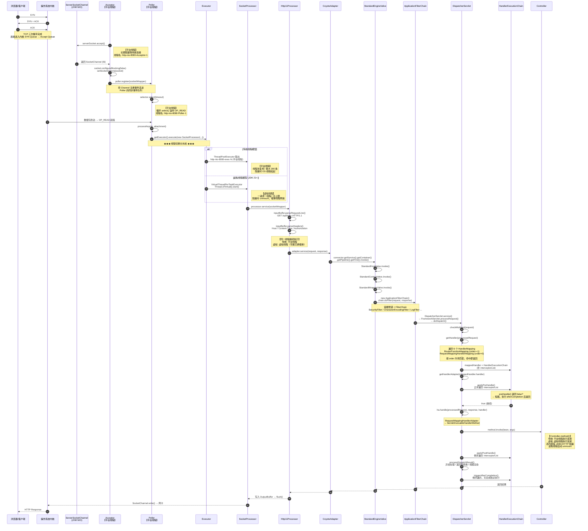

# Tomcat 请求处理完整时序图

> **版本环境**：Spring Boot 3.5.8 + Tomcat 10.1.x + Servlet 6.0 + JDK 21+  
> **文档范围**：从内核 `ServerSocketChannel.accept()` 到 `Controller.method()` 反射调用  
> **对比维度**：传统平台线程模型 vs 虚拟线程模型（`spring.threads.virtual.enabled=true`）

---

## 一、整体架构分层

```
┌─────────────────────────────────────────────────────────────┐
│  Layer 0: 操作系统内核 TCP/IP 协议栈                          │
│       ↓ SYN → SYN/ACK → ACK (三次握手)                       │
│       ↓ 数据包 → Socket 接收缓冲区                             │
├─────────────────────────────────────────────────────────────┤
│  Layer 1: JVM NIO 通道层（java.nio.channels）                 │
│       ServerSocketChannel.accept() → SocketChannel            │
├─────────────────────────────────────────────────────────────┤
│  Layer 2: Tomcat I/O 多路复用层（必须是平台线程）                │
│       Acceptor (1条平台线程) → Poller (1条平台线程)            │
├─────────────────────────────────────────────────────────────┤
│  Layer 3: Tomcat HTTP 协议解析层                               │
│       SocketProcessor → Http11Processor → CoyoteAdapter       │
├─────────────────────────────────────────────────────────────┤
│  Layer 4: Catalina Servlet 容器管道                            │
│       Engine → Host → Context → Wrapper → FilterChain         │
├─────────────────────────────────────────────────────────────┤
│  Layer 5: Spring MVC 分发层                                    │
│       DispatcherServlet → HandlerMapping → HandlerAdapter       │
├─────────────────────────────────────────────────────────────┤
│  Layer 6: 业务层                                               │
│       Interceptor.preHandle → Controller.method()              │
└─────────────────────────────────────────────────────────────┘
```

---

## 二、完整时序图



---

## 三、各阶段线程归属对照表

| 步骤 | 阶段 | 关键类/方法 | 传统线程模型 | 虚拟线程模型 | 备注 |
|:---:|------|-----------|:-----------:|:-----------:|------|
| 1 | TCP 三次握手 | 内核协议栈 | 内核线程 | 内核线程 | 与 JVM 无关 |
| 2 | 连接接受 | `Acceptor.run()` | **平台线程** × 1 | **平台线程** × 1 | 必须平台线程，`ServerSocketChannel` 绑定 |
| 3 | I/O 事件监听 | `Poller.run()` | **平台线程** × 1 | **平台线程** × 1 | 必须平台线程，`Selector.select()` 线程安全 |
| 4 | 任务提交 | `processSocket()` | `ThreadPoolExecutor.execute()` | `VirtualThreadPerTaskExecutor.execute()` | ★ 分水岭 |
| 5 | HTTP 解析 | `Http11Processor.service()` | 平台 Worker 线程 | 虚拟线程 | 代码路径完全一致 |
| 6 | 协议适配 | `CoyoteAdapter.service()` | 平台 Worker 线程 | 虚拟线程 | 容器管道不感知线程类型 |
| 7 | 容器管道 | `StandardWrapperValve.invoke()` | 平台 Worker 线程 | 虚拟线程 | FilterChain 顺序执行 |
| 8 | Spring 分发 | `DispatcherServlet.doDispatch()` | 平台 Worker 线程 | 虚拟线程 | |
| 9 | 拦截器 | `applyPreHandle()` | 平台 Worker 线程 | 虚拟线程 | 正序，可短路 |
| 10 | 业务反射 | `method.invoke(bean, args)` | 平台 Worker 线程 | 虚拟线程 | Controller 方法执行点 |
| 11 | 拦截器 | `applyPostHandle()` | 平台 Worker 线程 | 虚拟线程 | 倒序 |
| 12 | 资源清理 | `triggerAfterCompletion()` | 平台 Worker 线程 | 虚拟线程 | 倒序，**必定执行** |
| 13 | 响应输出 | `OutputBuffer.doFlush()` | 平台 Worker 线程 | 虚拟线程 | 客户端超时断开会抛 `ClientAbortException` |

---

## 四、线程模型全景对比

### 传统模型（默认）

```
┌────────────────────────────────────────┐
│  Acceptor        │ 平台线程 │ 1条     │
│  Poller          │ 平台线程 │ 1条     │
│  Worker ThreadPool│ 平台线程 │ 10~200条│
│     ├─ exec-1   │ 处理请求-1          │
│     ├─ exec-2   │ 处理请求-2          │
│     └─ exec-200 │ 处理请求-200 (上限) │
└────────────────────────────────────────┘
```

- **线程名**：`http-nio-{port}-exec-{N}`
- **阻塞代价**：JDBC / HTTP 调用阻塞时，占用 1 条平台线程，线程池快速耗尽
- **线程本地存储**：`ThreadLocal` 可跨请求复用（需注意清理，否则内存泄漏）
- **监控**：`jstack` 直接可见，线程数 = 并发处理能力硬上限

### 虚拟线程模型（`spring.threads.virtual.enabled=true`）

```
┌────────────────────────────────────────┐
│  Acceptor        │ 平台线程 │ 1条     │
│  Poller          │ 平台线程 │ 1条     │
│  Virtual Threads │ 虚拟线程 │ N条     │
│     ├─ VT-1     │ mount → ForkJoinWorker-1 │
│     ├─ VT-2     │ mount → ForkJoinWorker-2 │
│     ├─ VT-3     │ PARKED (JDBC阻塞) unmount │
│     └─ VT-100000│ mount → ForkJoinWorker-3 │
│  Carrier Threads │ 平台线程 │ ≈ CPU核数│
└────────────────────────────────────────┘
```

- **线程名**：默认 `""`（空字符串），IDEA 中显示为 `@virtual-{id}`
- **阻塞代价**：JDBC / HTTP 调用阻塞时，虚拟线程 **unmount**，载体线程立即执行其他虚拟线程
- **线程本地存储**：`ThreadLocal` 随虚拟线程销毁自动清理；`InheritableThreadLocal` **不继承**；推荐用 `ScopedValue`
- **监控**：`jstack` 看不到虚拟线程栈，需用 JFR (`jdk.VirtualThreadStart`) 或开启 IDEA "Show virtual threads"

---

## 五、关键源码坐标（Spring Boot 3.5.8）

| 阶段 | 类 | 方法 | 行号（约） |
|------|-----|------|----------|
| 连接接受 | `org.apache.tomcat.util.net.NioEndpoint` | `startInternal()` | 800+ |
| 连接接受 | `org.apache.tomcat.util.net.NioEndpoint.Acceptor` | `run()` | 120+ |
| I/O 监听 | `org.apache.tomcat.util.net.NioEndpoint.Poller` | `run()` | 450+ |
| 任务分发 | `org.apache.tomcat.util.net.NioEndpoint` | `processSocket()` | 1500+ |
| HTTP 解析 | `org.apache.coyote.http11.Http11Processor` | `service()` | 400+ |
| 协议适配 | `org.apache.catalina.connector.CoyoteAdapter` | `service()` | 350+ |
| 容器管道 | `org.apache.catalina.core.StandardWrapperValve` | `invoke()` | 120+ |
| FilterChain | `org.apache.catalina.core.ApplicationFilterChain` | `doFilter()` | 180+ |
| Spring 入口 | `org.springframework.web.servlet.FrameworkServlet` | `doService()` | 860+ |
| 核心分发 | `org.springframework.web.servlet.DispatcherServlet` | `doDispatch()` | 1050+ |
| 获取处理器 | `org.springframework.web.servlet.DispatcherServlet` | `getHandler()` | 1250+ |
| 拦截器前置 | `org.springframework.web.servlet.HandlerExecutionChain` | `applyPreHandle()` | 140+ |
| 方法适配 | `org.springframework.web.servlet.mvc.method.AbstractHandlerMethodAdapter` | `handle()` | 800+ |
| 反射调用 | `org.springframework.web.servlet.mvc.method.ServletInvocableHandlerMethod` | `invokeAndHandle()` | 400+ |
| 拦截器后置 | `org.springframework.web.servlet.HandlerExecutionChain` | `applyPostHandle()` | 170+ |
| 结果处理 | `org.springframework.web.servlet.DispatcherServlet` | `processDispatchResult()` | 1150+ |
| 最终清理 | `org.springframework.web.servlet.HandlerExecutionChain` | `triggerAfterCompletion()` | 190+ |

---

## 六、面试/考试速记

### 6.1 一句话总结每个阶段
1. **内核**：TCP 三次握手，连接进队列。
2. **Acceptor**：平台线程 `accept()` 拿 Channel，丢给 Poller。
3. **Poller**：平台线程 `select()` 等数据，就绪后提交 Executor。
4. **Executor**：传统用线程池（200 上限），虚拟用 `VirtualThreadPerTaskExecutor`（无上限）。
5. **Http11Processor**：解析请求行 + 请求头，生成 Coyote Request。
6. **Catalina 管道**：Engine → Host → Context → Wrapper → FilterChain。
7. **DispatcherServlet**：`doDispatch()` 是心脏，负责找 Controller、调拦截器、反射执行。
8. **Controller**：`method.invoke(bean, args)`，虚拟线程下阻塞自动卸载。
9. **响应回流**：`postHandle`（倒序）→ 结果转换 → `afterCompletion`（倒序，必执行）。

### 6.2 虚拟线程核心三句话
- **只替换 Worker 层**：Acceptor / Poller 必须是平台线程（Selector 绑定）。
- **解决 C10K**：不是加速单次请求，而是 I/O 阻塞时不占平台线程。
- **ThreadLocal 注意**：`InheritableThreadLocal` 失效；推荐 `ScopedValue`；虚拟线程销毁自动清理。

### 6.3 拦截器执行口诀
```
preHandle  正序走，返回 false 就短路；
postHandle 倒序走，Controller 之后视图前；
afterCompletion 倒序走，无论成败必执行。
```

---

## 七、常见问题速查

**Q：为什么 `handlerMappings` 有 6 个？**  
A：Spring Boot 注册了多种映射策略（`RouterFunctionMapping`、`RequestMappingHandlerMapping`、`WelcomePageHandlerMapping` 等），按 `order` 升序匹配，命中即返回。

**Q：`preHandle` 返回 `false`，`postHandle` 和 `afterCompletion` 谁执行？**  
A：`postHandle` **不执行**；`afterCompletion` **执行**（在 `applyPreHandle` 的短路分支中显式调用）。

**Q：调试时为什么出现 `ClientAbortException`？**  
A：断点停留时间过长，浏览器/Postman 超时断开 TCP 连接，Tomcat `flush()` 时发现 Socket 已死。

**Q：虚拟线程下 `server.tomcat.threads.max=200` 还有效吗？**  
A：语义变化，Tomcat 10.1.x 中该参数可能仅作为并发控制参考，虚拟线程数量不受此限制。

---

*文档生成时间：2026-04-26*  
*适用版本：Spring Boot 3.5.8 + Tomcat 10.1.x + JDK 21+*  
*渲染建议：使用支持 Mermaid 的 Markdown 阅读器（Typora、VS Code + 插件、GitHub）查看时序图*
